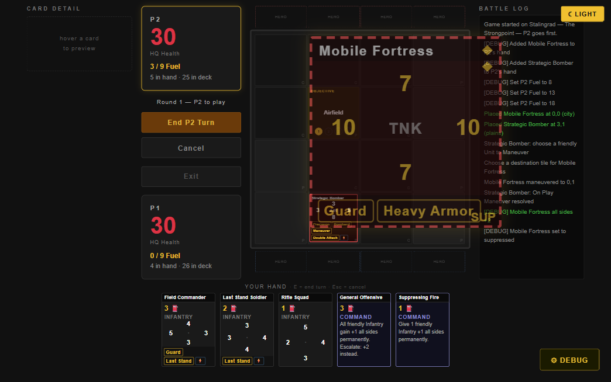
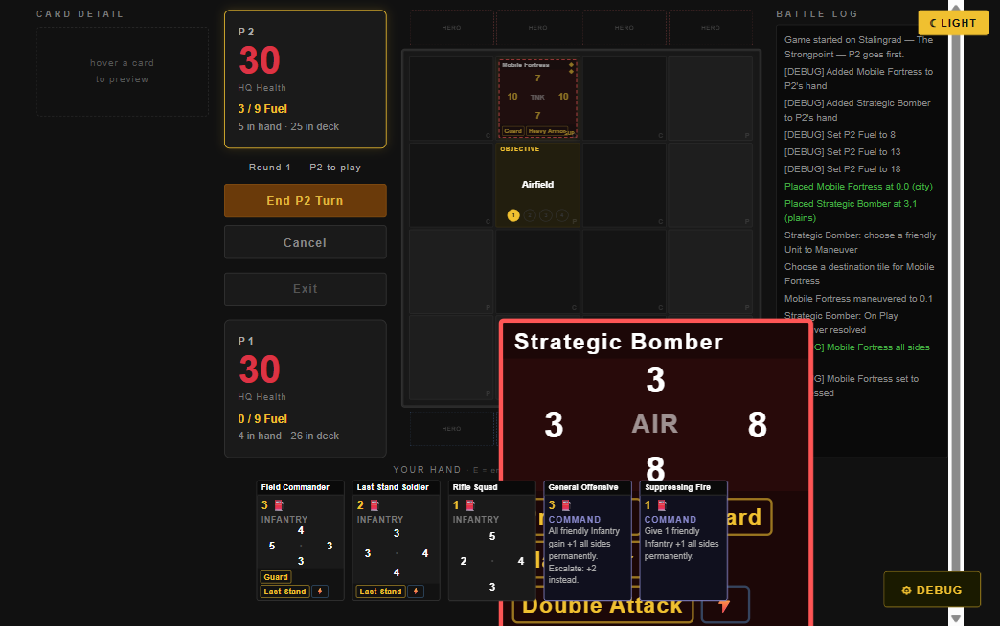

# SIGNAL — Gameplay UI & Visual Feedback Upgrade Plan

**Status:** Planning only — nothing in this doc has been implemented. No game code has been
changed as part of producing this plan. The live-verification steps described below (Playwright
against a local `npm run dev` server, using the built-in debug panel to construct test units)
only read and screenshotted the running prototype — no source file was edited.

**This revision (2026-09-01)** responds directly to Filip's review of the first draft. Where a
decision below changes or replaces something the first draft proposed (e.g. the "max 2 badges"
rule, the per-side stat-breakdown preview mockup), this version is the current, correct one —
no inline "SUPERSEDED" markers, per this project's own doc convention.

**Core principle — confirmed, keep as the north star for everything below:**
- **Battlefield = what is happening?**
- **Preview panel = why is this happening?**
- **Combat log = what happened previously?**

This document is organized in two parts. **Part 1** answers the 14 points from Filip's review,
in order — read this first. **Part 2** is supporting reference material (the full current-system
audit and event inventory) carried over from the first draft, trimmed to avoid repeating what
Part 1 already covers.

---

# PART 1 — RESPONSE TO REVIEW

## 1. Current Card-Layout Overlap Audit

Verified two ways: reading the exact box model in `buildBoardCard` (`js/ui.js`) and
`css/game.css`, and **live-rendering real cards in the actual running prototype** — started
`npm run dev`, used the built-in debug panel to add specific real cards to a player's hand,
placed them, and used the debug panel's Suppress/Buff tools to construct the exact kind of
maximal-clutter unit you described. Screenshots from that session are saved in
`digital/ui_audit_screenshots/` and referenced below.

### Root cause (confirmed in source, then confirmed on screen)

`buildBoardCard`'s HTML structure, top to bottom in document flow:
1. `.bc-name` — flow, top row (title)
2. `.bc-armor` (protection pips) — **position:absolute**, `top:2px; right:3px`
3. `.bc-dirs` (N/E/S/W stat grid) — flow, `flex:1` (expands/shrinks to fill remaining height)
4. `.bc-keyword-row` (keyword tags + ability pip) — flow, natural height, **last flow child**
5. `.bc-rotation` (⟳90°) — **position:absolute**, `bottom:1px; left:2px`
6. `.bc-state` (SUP/DEAD text) — **position:absolute**, `bottom:1px; right:2px`

Because `.bc-dirs` is `flex:1`, it always expands to consume whatever space `.bc-name` and
`.bc-keyword-row` don't use — which means `.bc-keyword-row` is *always* pinned to the literal
bottom edge of the fixed-height card. Items 5 and 6 are *also* pinned to that same bottom edge,
via absolute positioning instead of flow. Two different layout systems (flow-bottom vs.
absolute-bottom) are both targeting the same few pixels. This isn't a rare edge case that only
shows up with an unusual card — **it's structural**: any card with both a keyword tag and
Suppressed/rotated state will collide, because the collision is a property of the box model, not
of how much content is in it.

### Live confirmation

Test unit: **T39 Mobile Fortress** (printed Guard + Heavy Armor), buffed +2 all sides and set
Suppressed via the debug panel.



At 4x zoom, **"SUP" renders directly on top of the "Heavy Armor" keyword tag** — exactly the
collision you flagged for rotation, confirmed happening for the state badge too, via the
identical mechanism (both `.bc-rotation` and `.bc-state` use the same absolute-bottom-corner
positioning). Since the cause is structural, not content-specific, **rotation will collide with
the keyword row the same way**, confirmed by the same evidence even though this specific test
case wasn't rotated.

### Second confirmed case — keyword-row wrapping

Test unit: **A61 Strategic Bomber**, a real Set-1 card with 4 printed keywords (Precision,
Bombard, Maneuver, Double Attack) plus an On Play ability pip.



Confirmed live: the keyword row wraps to 2 lines with 4 tags. This makes the structural problem
above worse, not just wider — a taller keyword row has more surface area contesting the same
bottom-corner pixels that rotation/state badges are pinned to. Since keyword count is
uncapped by design (`ARCHITECTURE.md`: "no fixed maximum"), this isn't a bounded problem —
any future card with enough keywords will wrap further and collide more.

### Checked and cleared (good news, worth stating plainly)

- **Armor pips vs. name/stats grid:** predicted a possible collision (Heavy Armor's 2-pip stack
  is tall enough to theoretically reach into the stats grid). Live-checked on the same Mobile
  Fortress screenshot above — **no collision found**. `.bc-name`'s own row height plus its
  reserved `padding-right:16px` gutter is enough clearance. Not a real problem; no fix needed.
- **`.opponent-card` CSS hook:** confirmed via `element.className` readout on the live page —
  the class is applied (`"board-card p2 suppressed buffed opponent-card just-suppressed"`) but
  `game.css` has no matching rule anywhere. Dead code, not a visual bug (nothing collides,
  nothing is broken — it just does nothing). Flagged for cleanup, not urgent.

### Predicted, not yet live-verified — flag for explicit verification during implementation

- **Objective-tile card shrink.** `css/game.css`: `.objective-tile .board-card { inset: 20px 4px
  28px 4px; ... }` — a unit placed on an objective tile renders inside a noticeably smaller box
  than a normal tile (room is reserved for the objective header badge and level-dot track). Every
  overlap risk above gets *worse* here since there's less vertical room to begin with. I
  attempted to reproduce this live in the same session and couldn't get a card to place cleanly
  onto an objective tile through the debug flow in the time available (placement kept resolving
  as a tooltip-hover instead of a drop) — so this is a code-math prediction, not a screenshot.
  **Recommend explicitly testing a Suppressed/keyword-heavy unit on an objective tile as part of
  implementing the layout fix below**, since it's the tightest-fit case in the game.
- **Long unit names.** `.bc-name` truncates with `white-space:nowrap; overflow:hidden` — this
  prevents wrapping-related breakage, but very long names (e.g. "Ground-Attack Aircraft") will
  truncate hard. Minor, cosmetic, not a collision — noted for completeness.

---

## 2. Proposed Board-Card Information Architecture

Not a blind copy of the example structure in your brief — this is the layout the actual content
budget calls for, given the fixed square card size (`calc(var(--tile-size) - 8px)`, no auto-grow)
and the real worst-case content load confirmed above.

**The fix is structural, not decorative:** stop mixing flow-positioned and absolute-positioned
elements in the same bottom band. Every zone below is a flow child of the card's flex column, in
a fixed order, each with a bounded height — nothing is absolutely pinned into another zone's
space anymore.

```
┌─────────────────────────────────┐
│ ZONE A — HEADER                  │  name (truncates) + protection pips, top-right
│ [Mobile Fortress........] [◆◆]   │  (unchanged from today — confirmed collision-free)
├─────────────────────────────────┤
│ ZONE B — STATS                   │  N/E/S/W grid, flex:1 (unchanged core)
│         7                        │
│    10  TNK  10                   │
│         7                        │
├─────────────────────────────────┤
│ ZONE C — STATUS STRIP  (NEW)     │  fixed-height thin row, flow — NOT absolute
│ [SUP-icon]           [⟳90°-icon] │  suppressed/rotation/other single-glyph states
├─────────────────────────────────┤
│ ZONE D — KEYWORDS                │  wraps as needed, always LAST — nothing below it
│ [Guard] [Heavy Armor]            │  to collide with anymore
└─────────────────────────────────┘
```

**Why this fixes the collision structurally, not just for today's specific cards:** Zone C and
Zone D are now different rows in the same flex column, in a fixed order. Zone D can wrap to
2+ lines and grow — it's the last element, so growth just makes it taller, never overlapping
Zone C above it, because there is no more absolute positioning fighting over the bottom edge.

**Honest tradeoff to flag:** total card height is still fixed by tile size — it does not auto-grow.
Adding Zone C as a distinct row means Zone B (the stats grid, `flex:1`) absorbs a few pixels less
space when Zone C and a wrapped Zone D are both present. This is very likely fine — the stats
grid has real slack (single-glyph numbers in a 3x3 grid with several empty cells) — but should be
eye-checked during implementation on the worst real case (Heavy-Armor + Suppressed + rotated +
Strategic-Bomber-style 4-keyword card, on an objective tile) rather than assumed.

**Zone C is the actual fix.** Today's `.bc-rotation`/`.bc-state` absolute positioning is
replaced by a `.bc-status-strip` flex row: suppressed icon left-aligned, rotation icon
right-aligned, sized to a fixed ~12-14px height. This is the one new structural element this
whole plan needs — everything else (armor ring, keyword provenance styling, etc.) fits into the
existing Zone A/B/D without new zones.

---

## 3. Printed vs. Permanent-Granted vs. Temporary-Granted Keywords

Not blue (already means P1 identity, and — per the visual language below — also "movement").
The distinction needs to survive at ~8px font in a ~60-70px-wide tag, so it leans on **shape**,
not an additional hue:

| Provenance | Border | Fill | Glyph | Example |
|---|---|---|---|---|
| **Printed** (today's default look, unchanged) | solid gold outline | none (transparent) | none | `[Guard]` |
| **Permanently granted** | solid gold outline | **filled gold background**, dark text | none | `[Breakthrough]` *(filled)* |
| **Temporarily granted** | **dashed gold outline** | none | **⧗** prefix | `[⧗ Double Attack]` |

Why this set of choices:
- **Printed stays exactly as it looks today.** Printed keywords are the large majority of tags in
  the game — preserving the existing look for the common case means the new styling only has to
  be learned for the genuinely-different cases, not relearned everywhere.
- **Dashed = temporary reuses an idiom SIGNAL already has.** Suppressed already uses a dashed
  card border to mean "reduced/not-permanent." Reusing that same visual grammar for temporary
  keywords is more consistent than inventing a new one, and it means "dashed" starts building a
  single, learnable meaning across the whole game instead of two different things in two places.
- **Filled = permanent-granted reads as "locked in," distinct at a glance from printed's outline,**
  without a new hue competing with the positive/negative/protection/movement categories from the
  visual language (§9). Shape (outline vs. fill vs. dashed) is a channel independent of color, so
  it stacks cleanly with the hue-based category system rather than fighting it.
- **The ⧗ glyph is redundant with the dashed border on purpose** — relying on line-style alone at
  8px is risky for readability/colorblind-safety (per the accessibility discipline in the
  original draft), so temporary status gets two independent signals, not one.

**Tooltip content (extends the existing `KEYWORD_TEXT` mechanism):**

```
DOUBLE ATTACK
Attacks twice per activation.
Granted by: Blitzkrieg Order
Temporary — until end of turn
```

For a **printed** keyword the tooltip is just the rules text (as today — no "source" line needed,
since the source is "the card itself"). For a **granted** keyword (temp or permanent) it adds a
`Granted by: <source>` line, and for temporary specifically a `Temporary — <expiry text>` line.
This needs the same source-metadata addition described in §7 below — one data-model change
serves both the tooltip and the preview panel.

---

## 4. Displaying ALL Active Keywords Without Clutter

Agreed: hiding keywords is off the table — a "+N more, see preview" collapse (my first draft's
instinct) directly contradicts "no gameplay-relevant information should disappear from the
board." Rejecting that approach; solving it in the layout instead.

**The real lever here is compactness, not count-capping** — per your own note that "different
information doesn't necessarily need to be represented using identical chips":

- **Board card (smallest, ~85px):** keyword tags render as **short abbreviations**, not full
  words — `GRD` (Guard), `H.ARM` (Heavy Armor), `PREC` (Precision), `BOMB` (Bombard), `MNVR`
  (Maneuver), `DBL ATK` (Double Attack), etc. A confirmed real case — Strategic Bomber's 4
  keywords (Precision, Bombard, Maneuver, Double Attack) — goes from wrapping to 2 full-width
  lines today to very plausibly fitting on 1-2 much shorter lines as abbreviations, directly
  shrinking Zone D's footprint and reducing pressure on Zone B (§2's honest tradeoff).
- **Hand card (92×126px, real room to spare):** full keyword text, unchanged from today — no
  compactness pressure at this size.
- **Preview panel (biggest, dedicated space):** full keyword text plus the complete tooltip and
  provenance line from §3 — this is where "why" always lives, per the core principle.

Every keyword is still visibly present on the board card at all times — abbreviated, not hidden.
Hovering (or the preview panel, once §7 lands) always gives the full name and rules text. This
keeps the "no information disappears" rule intact while directly attacking the actual cause of
clutter (long text at small scale), not working around it with a cap.

---

## 5. Destruction FX — Concepts and Recommendation

**Shared constraint for all three concepts** (from the original draft, still true): the engine
nulls a destroyed unit's board tile the instant it dies — there's no lingering "dying" unit to
animate across multiple renders without a small architecture change. Each concept below is
described first at *full* fidelity, with a note on what's achievable without that change (see the
Phase A/B split in §12).

**Concept A — Reticle flash (your lead idea).** A small, closed WW2-gunsight-style reticle
(circle + 4 short tick marks, red) flashes centered over the dying card — scale-pulse
(1.0→1.15→1.0) with a brief 2-3px shake, ~150-200ms — then the card collapses/fades, tile clears.

**Concept B — Red stamp mark.** A bold red diagonal double-strike ("✕") snaps across the card's
header/name strip only (not the whole face, to avoid fully obscuring the card during its last
visible moment) with a slight rotation, like a casualty report being crossed off — holds briefly,
then the card fades.

**Concept C — Closing target brackets.** Four small L-shaped corner brackets snap inward from
just outside the card toward its edges (a "target acquired and eliminated" idiom) — then fade,
card collapses.

**Recommendation: Concept A (reticle), simplified — closed reticle, no snap-in brackets.**
Genuinely weighed Concept B against it, not just defaulting to your first suggestion: a stamp/X
is more universally legible with zero learning curve, and I considered leading with it. But
SIGNAL's established visual vocabulary is already a *battlefield/map* language (terrain tiles,
objective badges, unit classes) rather than a *paperwork* one — a gunsight reticle fits that
existing world; a rubber-stamp reads a register closer to "administrative report," which is a
different tone than the rest of the board. Concept C is rejected as the weakest fit: 4 separate
corner marks are the hardest of the three to parse as one instant gestalt at ~85px, and "closing
brackets" reads more like a modern targeting HUD than a WW2 tactical board game.

**Sequence (full version):** impact reticle flash + shake (~200ms) → collapse/fade (~300ms) →
tile clears with the existing red inset flash as trailing confirmation (~150ms). ≈650ms total,
inside the MAJOR budget (§10).

---

## 6. Armor / Heavy Armor Frame — Concepts and Recommendation

**Concept 1 — Outer protection ring (recommended).** A thin (1px) inset ring, in the
protection-blue hue from the visual language (§9), sitting just inside the existing owner-color
border. Armor = single ring. Heavy Armor = two concentric rings with a hairline gap. On an
absorbed hit: the outer ring segment flashes bright, a brief diagonal "crack" line appears across
it, then that layer fades out — for Heavy Armor, the remaining inner ring becomes the new
"current" layer; for Armor, the ring is simply gone.

**Concept 2 — Corner shield tabs.** Keep the existing pip *position* (top-right) but restyle the
pip glyphs from ◆ to small shield icons; a consumed hit cracks and fades that one tab. Cheapest
option — reuses the current DOM/positioning wholesale.

**Concept 3 — Tinted background wash.** A subtle protective-blue tint across the whole card
interior while Armor/Heavy Armor is active, clearing (partially, then fully) as hits absorb.
Cheapest to build (a background-color toggle) but risks visually competing with the existing
owner-color background and the buffed gold glow — three different background/frame treatments
stacking is exactly the clutter this whole plan is trying to avoid.

**Recommendation: Concept 1.** Your own Divine-Shield comparison is fundamentally about the
*whole unit* reading as protected, not a corner decoration reading as protected — a full ring
delivers that "shell around the card" feeling in a way a corner tab (Concept 2) undersells and a
background tint (Concept 3) muddies. It also reuses the protection-blue hue already established
in the visual language (§9) instead of introducing a fourth background treatment. **Keep the
existing pips too, as the precise numeric readout** ("exactly how many hits remain") alongside
the ring's fast "am I still protected, yes/no" glance — this is the redundant-channel
accessibility pattern from the original draft, not a contradiction of Concept 1.

**Absorb sequence:** outer ring segment flashes bright (~100ms) → crack line (~100ms) → layer
fades (~150ms), paired with an `FxPopupText` "ARMOR ABSORBED" and the pip count updating in the
same beat. ≈350ms, a STATE CHANGE-tier event (§10).

---

## 7. Direct Hit — Revised SOURCE → TARGET → RESULT Sequence

```
1. SOURCE glow  (~150-200ms)
   The specific unit converting its unused attack pulses gold, directly on its board tile.

2. TRAJECTORY   (~150ms)
   A brief, thin fading directional line/streak from that tile toward the target player's
   HQ stat block — not a literal arc, just enough to read "this came from there."

3. IMPACT — "DIRECT HIT"   (~200ms)
   FxPopupText stamp near the target's stat block (attributable to WHICH player's HQ,
   since both stat blocks are always visible on screen at once).

4. RESULT   (~150ms)
   HQ number does its scale-pulse + red flash (reusing the same FxFlash primitive as
   everything else), number updates.
```
≈650-700ms total — MAJOR tier (§10).

**Multiple simultaneous Direct HQ sources** (`evaluateDirectHQ` sweeps *all* qualifying units in
one end-of-turn pass, so this is a real case, not a hypothetical): **batch by target, not by
source.** All units converting against the *same* HQ in the same sweep pulse together (step 1,
simultaneous), one converging-trajectory moment (step 2), **one** "DIRECT HIT ×N" stamp with the
summed total (step 3), **one** HQ pulse for the combined damage (step 4) — rather than replaying
the full ~650ms sequence once per unit, which would make a big end-of-turn sweep take
uncomfortably long. This is a concrete, scoped batching rule, not the full SequenceQueue — fits
the "short, mostly non-blocking" mandate for Phase A/B without needing the Phase C architecture.

---

## 8. Live Card-Preview / "Current Effects" — Final Design

Reorganized from the first draft's per-side breakdown (which repeats a source 4 times when it
affects all sides equally — "N +2 Inspire, E +2 Inspire, S +2 Inspire, W +2 Inspire") to a
**source-grouped list**, matching the shape of your own example more directly and reading more
compactly for the common case (one source affecting all sides at once):

```
┌─ CARD DETAIL ──────────────────────┐
│ MOBILE FORTRESS              [SUP]  │
│ Tank · 7 Fuel · Heavy Armor (1/2)   │
│ ──────────────────────────────────  │
│  N 7 ▲   E 10 ▲   S 7 ▲   W 10 ▲    │   (compact stat row, unchanged shape from today)
│ ──────────────────────────────────  │
│ CURRENT EFFECTS                     │
│ ▲ +2 all sides — Debug Buff          │
│ ⬤ Guard — printed                    │
│ ⬤ Heavy Armor — printed              │
│    1 of 2 protection remaining       │
│ ▼ Suppressed — enemy attack          │
│ ──────────────────────────────────  │
│ GUARD                                │
│ Enemy units must attack this unit    │
│ before other valid targets.          │
└──────────────────────────────────────┘
```

Design notes:
- Every line in **CURRENT EFFECTS** uses the same icon vocabulary as the battlefield-level visual
  language (§9): ▲ gold = positive, ▼ red = negative, ⬤ gold = protection/printed-keyword, ⧗
  (not shown here, none active) = temporary. **The preview panel teaches the same visual language
  the battlefield uses**, rather than being a separate system with its own conventions — directly
  serves the brief's "the player should eventually learn this visual language subconsciously,"
  extended from the battlefield into the inspector.
- A side-specific bonus (e.g. `objSideBonus` hitting only North) gets its own line — `▲ +1 north
  — Objective L2` — rather than being folded into the all-sides line, so nothing is lost from the
  original per-side idea; it just doesn't repeat when a source affects every side identically.
- Rotation, when present, gets its own line: `⟳ Rotated 90° — Change Formation`.
- Whatever the player is hovering (a unit, a hand card, an objective) still populates the same
  `.cp-effect` area below with rules text, as today — this design only replaces the top portion.

**Data-model requirement (the real cost here — bigger than the first draft scoped it):** this
needs every bonus *and every keyword grant* to carry `{ amount/effect, label, source, temporary,
expiry }`-shaped metadata, not a bare number or a bare string. The first draft only scoped this
for the numeric bonus fields (`tempSideBonus` etc.); §3's provenance styling and this section's
keyword-source lines mean **keyword grants need the same treatment** — every
`tempKeywords.push('Guard')`-shaped call site in `combat.js`/`game.js` needs to also record why
and how long. This is genuinely bigger than "Medium" as originally sized — see §13's complexity
table.

---

## 9. Updated Visual Language

Unchanged core (still the right formalization of what already exists in the CSS): gold =
positive, red = negative, the existing teal-blue `--log-absorb` = protection, the existing light
blue used for rotation = movement, `--p1`/`--p2` reserved for player identity only.

**New this revision — a second, independent dimension for keyword provenance (§3):** shape
(solid outline / filled / dashed) plus the ⧗ glyph, layered on top of the hue system rather than
competing with it. Hue answers "what kind of thing is this" (buff/debuff/protection/movement);
shape now answers "how long does this last" — the two dimensions are orthogonal by design so
adding the provenance system didn't require inventing new hues that would dilute the original
four-category language.

| Dimension | Values | Question it answers |
|---|---|---|
| Hue | gold / red / teal-blue / light-blue | What kind of change is this? |
| Shape (new) | solid outline / filled / dashed | Printed, permanent-granted, or temporary-granted? |
| Glyph (new, temporary only) | ⧗ | Redundant confirmation of "temporary," for accessibility |

---

## 10. Updated Animation Priority

Reclassified from the first draft's magnitude-based rule ("buff ≥2 = Tier 2," which you correctly
called overengineered) to **event-type-based**, per your instruction:

### MAJOR (~400-800ms)
Destroy, Direct Hit, Objective captured/control-flip, Hero Active Power resolution, Win/loss.

### STATE CHANGE (~200-400ms)
Suppress applied/removed, Armor hit/broken, Keyword gained/lost (temporary or permanent), any
buff/debuff applied (**any magnitude — the ≥2 threshold is dropped**), Passive/Hero-power
triggered (the result-side flash; source-side causality pulses are §14/Phase B), Rally /
Breakthrough / Last Stand triggering, Objective level escalation.

### MICRO (~100-200ms)
Fuel gain/loss, cost discount/tax display change, card drawn, rotation applied. (Individual stat
ticks aren't a separate category here — they're the visible result of a STATE CHANGE-tier buff/
debuff event, not their own event type.)

These are starting points, not locked values — per your note, tune by feel once Phase A is
actually playable, not by further spec work now.

---

## 11. Complete UI Feedback Matrix

Source-of-truth reference for every current SIGNAL event/state. Future keywords should be
slotted into this table's pattern rather than getting a bespoke treatment invented from scratch.

| Event/State | Persistent Board Indicator | Trigger FX | Text | Source Indication | Preview Detail | Log | Priority |
|---|---|---|---|---|---|---|---|
| Normal hit → Suppressed | Zone C icon (dashed frame) | Red flash *(color-fixed from today's gold)* | — | attacker (implicit) | state + cause | Yes | STATE CHANGE |
| Suppression removed | Zone C icon clears | Gold flash | — | — | — | Yes | STATE CHANGE |
| Hit → Destroyed | none after removal | Reticle + shake + collapse (§5) | optional "DESTROYED" | attacker | — | Yes | MAJOR |
| Armor absorbs | Protection ring + pips | Ring crack (§6) | "ARMOR ABSORBED" | attacker (implicit) | remaining protection | Yes | STATE CHANGE |
| Heavy Armor absorbs (2nd layer) | Ring drops to 1 layer | Ring crack (§6) | "ARMOR ABSORBED" | attacker (implicit) | remaining protection | Yes | STATE CHANGE |
| Direct HQ damage | HQ number | Source→HQ sequence (§7) | "DIRECT HIT" | source unit(s), batched by target | — | Yes | MAJOR |
| Objective HQ backbone dmg | HQ number | Flash on HQ number | damage number | objective tile (implicit) | — | Yes | STATE CHANGE |
| Objective secondary effect | varies by effect | matches the effect's own category | effect-specific | objective tile | full L1-L4 text (exists) | Yes | STATE CHANGE |
| Fatigue damage | HQ number | Flash on HQ number | "FATIGUE" | — | — | Yes | STATE CHANGE |
| Guard | keyword tag (§3/§4 styling) | none (passive restriction) | — | — | tooltip (new, §3) | implicit via blocked targeting | — |
| Precision | keyword tag | none | — | — | tooltip (new) | — | — |
| Bombard | keyword tag | none (wider targeting UI, exists) | — | — | tooltip (new) | — | — |
| Blast (secondary hits) | — | batched flash on all secondary targets | — | primary target (implicit) | — | Yes (indented, exists) | STATE CHANGE |
| Barrage (secondary hits) | — | batched flash on all secondary targets | — | primary target (implicit) | — | Yes (indented, exists) | STATE CHANGE |
| Double Attack (2nd hit) | — | none distinct from a normal attack | — | — | tooltip (new) | — | — |
| Breakthrough triggers | source pulse (Phase B) | causality pulse (Phase B) | keyword name (brief) | attacker | tooltip (new) | Yes | STATE CHANGE |
| Rally triggers | source pulse (Phase B) | causality pulse (Phase B) | keyword name (brief) | attacking unit | tooltip (new) | Yes | STATE CHANGE |
| Inspire (aura active) | recalculated stat glow (exists) | source pulse (Phase B) | — | Inspire source unit | exact source (§8) | Yes | STATE CHANGE |
| Muster (aura active) | recalculated stat glow (exists) | source pulse (Phase B) | — | Muster source unit | exact source (§8) | Yes | STATE CHANGE |
| Last Stand triggers | — | causality pulse (Phase B) | keyword name (brief) | the destroyed unit | tooltip (new) | Yes | STATE CHANGE |
| Maneuver resolves | unit re-renders at new tile | brief move/fade (Phase B, optional) | — | — | tooltip (new) | Yes (exists) | STATE CHANGE |
| Escalate (upgraded state) | keyword tag styling change (Phase B) | brief flash on first upgrade | — | — | tooltip notes "upgraded" | Yes | MICRO |
| Craft (candidate picked) | new keyword tag appears | none beyond placement | — | — | tooltip (new) | Yes (modal exists) | STATE CHANGE |
| Buff (temp or permanent, any magnitude) | per-side ▲ digit (exists) + provenance-styled source line | flash (magnitude-independent now) | — | source (§8) | full breakdown (§8) | Yes | STATE CHANGE |
| Debuff | per-side ▼ digit (exists) + **new persistent dim/red frame** (§9, parity fix) | flash | — | source | full breakdown | Yes | STATE CHANGE |
| Cost discount/tax | hand-card cost color (exists) | none | — | — | — | — | MICRO |
| Fuel gain/loss | fuel number | brief tick flash (new, cheap) | small +/- floater (optional) | — | — | Yes | MICRO |
| Max Fuel change (Logistics Chief) | fuel cap number | brief flash on change | — | Hero (implicit) | — | Yes | MICRO |
| Card drawn | hand re-renders | none needed | — | — | — | Yes | MICRO |
| Discard (hand-cap overflow) | — | — | — | — | — | (not currently logged) | MICRO |
| Rotation applied | Zone C icon | brief pulse | — | — | rotation line (§8) | Yes (exists) | MICRO |
| Hero deployed | zone fills | none needed | — | — | full card (exists) | — | — |
| Hero Active Power fires | zone ready→spent (exists) | source pulse (Phase B) | ability name (brief) | Hero zone | full card (exists) | Yes | MAJOR |
| Hero Passive triggers | — | causality pulse (Phase B) | ability name (brief) | Hero zone | full card | Yes | STATE CHANGE |
| Objective control gained/lost | tile background (exists, no transition) | flash + brief flag-plant motion (Phase B) | controller change | — | control line (exists) | Yes | MAJOR |
| Objective level escalates | level-dot track (exists, no transition) | flash on the new active dot | "L1→L2" | — | full L1-L4 text (exists) | Yes | STATE CHANGE |
| Terrain-blocked placement | tile stays unhighlighted + **new** blocked cue | brief red-tinge on attempted drop | "Blocked by terrain" | — | — | — | MICRO |

---

## 12. Revised Phase A / B / C

Reordered from your proposal where the technical findings above give a concrete dependency
reason — explained inline, nothing moved without a stated cause.

### Phase A — Core Readability (ordered; each numbered item is a real dependency of the ones below it)

1. **Card information architecture fix (§2)** — the new Zone C status strip. Blocks every other
   visual item below, since they all render into this layout.
2. **Bonus/keyword source-metadata data model (§8)** — `{amount/effect, label, source, temporary,
   expiry}`. Blocks the stat-source inspector and the keyword-provenance styling.
3. **`FxFlash` / `FxPopupText` reusable primitives** — generalizes today's one-off
   `suppress-flash`/`destroy-flash` keyframes into a parameterized system (gold/red/protection-
   blue variants + a floating-text popup). Blocks items 6-8.
4. Complete keyword tooltip coverage, all 16 (pure content, no dependency — can run in parallel
   with 1-3).
5. Keyword provenance chip styling (§3) — needs item 2.
6. Suppression redesign — icon into Zone C (item 1), corrected-to-red flash (item 3).
7. Armor/Heavy Armor protection ring + absorb-crack FX (§6) — needs item 3.
8. Direct Hit, light sequence (§7) — needs item 3.
9. Live board-unit preview rebuild, "Current Effects" (§8) — needs item 2.
10. **Debuff persistent frame** — pulled forward from your Phase B list. It's a direct mirror of
    the existing `.buffed` halo (already built), inverted for negative values — no dependency on
    anything above, trivial cost, and it's a concrete asymmetry the original audit already found.
    No reason to hold a near-zero-cost fix back to "Phase B" just because it's thematically about
    causality like the rest of that phase.
11. **Destruction — light version only.** Full collapse sequence needs the ghost-render
    architecture (item below, Phase B) to look smooth across multiple render frames. A *lighter*
    version is achievable without that: delay the destroy commit by ~250ms, during which the
    reticle-flash + shake (§5) plays on the still-fully-rendered dying unit; after the delay,
    commit the null state as today. Gets most of the "this unit was destroyed" clarity into Phase
    A cheaply; the smoother multi-stage fade is deferred to Phase B.
- *(optional, if capacity allows)* Terrain-blocked placement affordance — cheap, fully
  independent of everything else in this list, can slot in anywhere without disrupting the order.

### Phase B — Causality & Major Events

- **Destruction — full version.** Replaces Phase A's commit-delay hack with proper ghost-render
  `transitionFlags` (carrying the last-known unit), enabling a smoother multi-stage collapse
  instead of an abrupt disappear-after-delay.
- Passive/Hero trigger source visualization (causality pulse: source glow → target flash),
  reusing Phase A's `FxFlash` primitive.
- Hero activation visualization.
- Objective capture/level feedback — needs a `transitionFlags`-equivalent concept for objectives,
  which don't currently have one (only board units do).
- Terrain-blocked feedback, if not already done in Phase A.
- Debuff persistent treatment — ~~moved to Phase A, see above~~ *(removed from this list, done in A)*.
- Recent-change residue (§15 discussion below) — conditional on what Phase A/B playtesting
  actually shows, as you proposed.

### Phase C — Advanced Polish (unchanged from your proposal)

Only after playtesting A+B:
- Full animation `SequenceQueue`, only if multi-effect chains still prove hard to follow without
  it.
- `FxConnector` source→target lines, if the causality pulse's plain glow-then-flash isn't enough
  on a crowded board.
- Log→battlefield linking.
- Accessibility/reduced-motion and colorblind-contrast pass beyond the baseline discipline already
  built into §9-§10.
- Sound, as a fully separate future decision (SIGNAL has no audio layer today).

---

## 13. Additional Overlap/Readability Problems Found

Beyond the rotation/keyword collision you already knew about:

1. **Keyword-row wrapping compounds the collision, confirmed live (§1).** Not just "more
   keywords = more clutter" in the abstract — a 4-keyword real card (Strategic Bomber)
   demonstrably wraps to 2 lines today, which pushes even more content into the exact band that
   collides with Zone C.
2. **Objective-tile placement is the tightest layout case in the game** (§1) — every fix above
   needs to be checked there specifically, not just on open tiles, since the CSS reserves extra
   space for the objective header/dot-track on top of everything else.
3. **The debuff/buff asymmetry is a real, checkable gap, not a style nitpick** — `.buffed` gives
   a persistent halo; nothing equivalent exists for negative `tempSideBonus`. A unit debuffed on
   3 of 4 sides doesn't currently read as "this card is weak right now" the way a buffed card
   reads as strong. Folded into Phase A as item 10 above.
4. **`Escalate`'s "upgraded" state has no visual marker at all today** — once a named Escalate
   card has been used once by a player, every later copy/use resolves the bigger effect, but
   nothing on the card or in the UI currently distinguishes "this will resolve as upgraded" from
   "this will resolve at base strength." Worth a small marker (Phase B, folded into the matrix
   above as MICRO) even though it wasn't explicitly called out in the brief.
5. **`Discard Pile` overflow currently has zero feedback of any kind, including in the log** —
   per `STATUS.md`, nothing reads this zone yet, so it's low priority, but flagged here since it's
   a genuine dead spot: a card silently disappearing from a full hand with no on-screen trace at
   all is worth at minimum a log line once anything interacts with that zone.

---

## 14. Exact Recommendation for What to Implement First

**Start with Phase A items 1 and 3 together, as one connected first slice:** the card
information-architecture fix (§2) and the generalized `FxFlash`/`FxPopupText` primitives (§12).

Reasoning: these two are pure structure/CSS/utility-JS — they need no new gameplay data, so they
carry zero risk of touching `combat.js`'s effect-resolution logic. Every other Phase A item
either **renders into** the fixed layout (so building it first means nothing built afterward
needs rework) or **consumes** the FX primitives (so building them first means every subsequent
visual item is strictly additive). It also directly fixes the exact bug you already knew about
and that this session confirmed live with a screenshot — the fastest path to a visible,
demonstrable improvement.

**Second: the bonus/keyword source-metadata data model (§8/item 2).** This is the more invasive
piece (many call sites across `combat.js`/`game.js`), but doing it second means the stat-source
inspector it unlocks can be built and *seen working* against the already-fixed layout, rather
than being developed against a card layout that's still going to change underneath it.

Everything else in Phase A (items 4-11) is then unblocked and can proceed in whatever order suits
available time, since none of them depend on each other — only on items 1-3.

---

# PART 2 — SUPPORTING REFERENCE (carried over from the first draft)

This part is unchanged background material, kept for traceability. Where anything here conflicts
with Part 1 above (destruction treatment, armor treatment, direct-hit treatment, stat-source
inspector layout, visual language, priority tiers, phase assignments), **Part 1 is current —
this part is the original audit and inventory that Part 1 was built on.**

## Audit — Current Gameplay Feedback Systems (original findings, still valid)

See the original draft's full table for the complete list. Headline points, still accurate:
board-unit hover previously read only the static card template (fixed by §8 above); 11 of 16
keywords had no tooltip (fixed by the keyword-tooltip item in §12); the suppression flash used
gold, the game's positive color, for a debuff (fixed by §12 item 6); armor-absorb and Direct HQ
had zero dedicated feedback of any kind (fixed by §12 items 7-8); `.opponent-card` is a dead CSS
hook (confirmed again live, §1); `.board-card.destroyed` styling is effectively unreachable since
destroyed units are nulled from state instantly (still true, still low priority).

## Complete Gameplay Event/State Inventory (original, still valid — now folded into §11's matrix)

The original draft's category-by-category inventory (Damage & Combat, Protection, Buffs/Debuffs,
all 16 Keywords, Movement, Resource/Economy, Hero Layer, Objectives, Terrain) is now represented
row-by-row in the Complete UI Feedback Matrix (§11) above, with each event's *current* feedback
replaced by its *planned* feedback per this revision. Refer to §11 rather than re-deriving from
the category tables — they'd now just repeat the same rows in a different shape.

## Accessibility / Readability Considerations (original, still valid, extended by §9's shape dimension)

Never rely on color alone (now reinforced by §3/§9's shape-based provenance system, which was
designed specifically to not add a fifth competing hue); respect `prefers-reduced-motion`; the
original's "max 2 persistent badges" rule is **retracted per this revision** — replaced by the
Zone C/D architecture in §2, which solves the same real problem (corner-badge crowding) without
hiding information, per your explicit requirement in §2 of your review.

## Reusable UI Components (original list, `FxFlash`/`FxPopupText` now specified in detail above)

`FxFlash`, `FxPopupText`, `CardPreviewPanel` (extended per §8), `FloatingTip` (extended per §3/§6),
`FxConnector` (Phase C, unchanged), `SequenceQueue` (Phase C, unchanged, explicitly not built in
Phase A per your instruction in §12 of your review). One addition this revision: a
`ProtectionRing` component (§6) and a `StatusStrip` component (§2, Zone C) — both new, both
reusable across every unit that has Armor/Heavy Armor or Suppressed/rotation state respectively.
